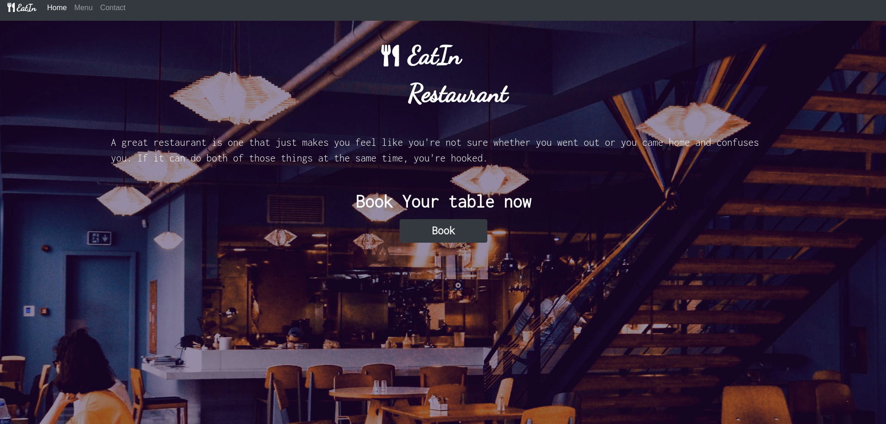

# Restaurant-Page

> Project was based on creating a restaurant page using javascript to generate the tabs.
> Each tab has a different content. Such as Home page, Contact page and Menu page.
> Also using a single div element inside the HTML to append all the content.

## Built With

- Webpack
- Npm
- Javascript

## Live Demo

[Live Demo Link](https://hamayun-cpu.github.io/Restaurant-Page/)

## Getting Started

**To get started you can download the code by pressing in the top right corner on the green button**

> To get a local copy up and running follow these simple example steps.

### Prerequisites

- Npm installed on your computer
- Node as well

### Install

> Once you have downloaded the code please open you terminal and paste in this code
> `git clone https://github.com/hamayun-cpu/Restaurant-Page.git`
> then run this command to install all of the depencies for the app to run ` npm install`

### Usage

> In order to run the app once you have already installed it please run this comman in your terminal
> `npm run watch`
> then click on the index.html and open it with liver server
> this will open a new browser with the app ready to use.

## Authors

👤 **Hamayun Waheed**

- Github: [@githubhandle](https://github.com/hamayun-cpu)
- Twitter: [@twitterhandle](https://twitter.com/hamayun_waheed?s=09&fbclid=IwAR0rfO9cMDDeCX8LfXf4cCNQDrL4LpJ02Q2csWhcT-VtMQ0Cy9EgTB4Wq8E)
- Linkedin: [linkedin](https://www.linkedin.com/in/hamayun-waheed-3527381b2/)

## 🤝 Contributing

Contributions, issues, and feature requests are welcome!

Feel free to check the [issues page](https://github.com/hamayun-cpu/Restaurant-Page/issues).

## Show your support

Give a ⭐️ if you like this project!

## 📝 License

This project is [MIT](lic.url) licensed.
